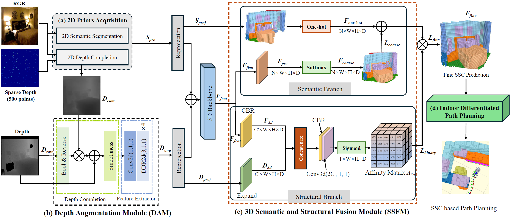
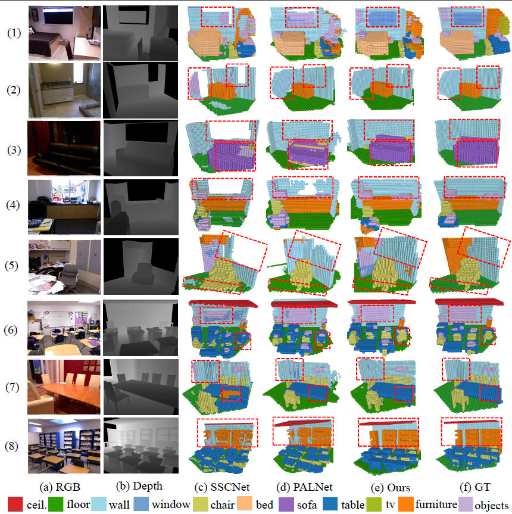
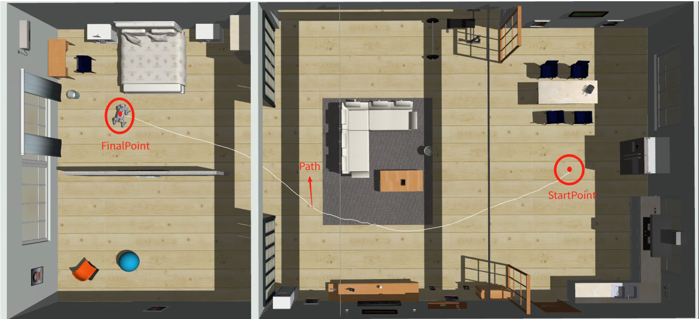
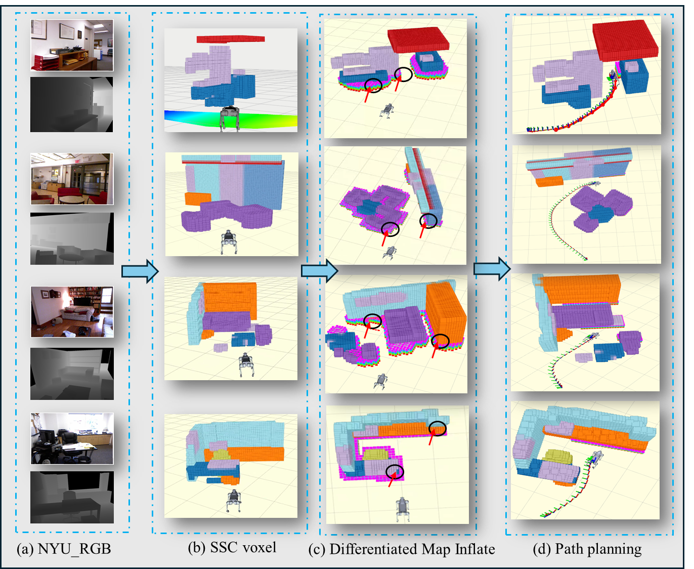

# DSFNet-based-SEGO
DSFNet is a 3D SSC framework for indoor RGB-D. DAM uses depth completion to repair noisy/incomplete depths. SSFM fuses 2D semantic priors with geometric features for accurate voxel occupancy and labels. The resulting maps drive SEGO, a risk-aware planner producing smoother, safer paths. Validated on NYU/NYUCAD and Gazebo.






## Contents

0. [Installation](#installation)
0. [Data Preparation](#Data-Preparation)
0. [Train and Test](#Train-and-Test)
0. [Visualization and Evaluation](#visualization-and-evaluation)
0. [Go2 Gazebo Simulation](#Go2 Gazebo Simulation)
0. [Citation](#Citation)

## Installation

### Environment (Recommended):

- Ubuntu 20.04
- python 3.6
- CUDA 11.8

### Requirements (Recommended):

- [pytorch](https://pytorch.org/)≥2.0.0
- [torch_scatter](https://github.com/rusty1s/pytorch_scatter)
- imageio
- scipy
- scikit-learn
- tqdm

You can install the requirements by running `pip install -r requirements.txt`.

If you use other versions of PyTorch or CUDA, be sure to select the corresponding version of torch_scatter.


## Data Preparation

### Download dataset

The raw data can be found in [SSCNet](https://github.com/shurans/sscnet).

The repackaged data can be downloaded via [waterljwant/SSC](https://github.com/shurans/sscnet) on [Google Drive](https://drive.google.com/drive/folders/15vFzZQL2eLu6AKSAcCbIyaA9n1cQi3PO?usp=sharing) or [Baidu Cloud (access code: lpmk)](https://pan.baidu.com/s/1mtdAEdHYTwS4j8QjptISBg).

The repackaged data includes:

```python
rgb_tensor   = npz_file['rgb']		# pytorch tensor of color image
depth_tensor = npz_file['depth']	# pytorch tensor of depth 
tsdf_hr      = npz_file['tsdf_hr']  	# flipped TSDF, (240, 144, 240)
tsdf_lr      = npz_file['tsdf_lr']  	# flipped TSDF, ( 60,  36,  60)
target_hr    = npz_file['target_hr']	# ground truth, (240, 144, 240)
target_lr    = npz_file['target_lr']	# ground truth, ( 60,  36,  60)
position     = npz_file['position']	# 2D-3D projection mapping index
```

### 

## Train 

### Configure the data path in [config.py](https://github.com/waterljwant/SSC/blob/master/config.py#L9)

```
'train': '/path/to/your/training/data'

'val': '/path/to/your/testing/data'
```

### Train

Edit the training script [run_train.sh](https://github.com/XH-hlx/DSFNet-based-Indoor-Nvigation/blob/main/DSFNet/run_train.sh#L4), then run

```
bash run_train.sh
```

## Visualization and Evaluation

comging soon


## Go2 Gazebo Simulation

### Option 1: Test DSFNet Only

```bash
# Terminal 1: Start roscore
roscore

# Terminal 2: Play your RGB-D data
rosbag play your_rgbd_data.bag

# Terminal 3: Launch DSFNet inference
roslaunch unitree_ssc_navigation test_dsfnet.launch \
  model_path:=~/ros1_ws/DSFNet/models/best_model.pth

# Terminal 4: Visualize in RViz
rviz
# Add:
# - PointCloud2: /ssc/point_cloud (colored semantic output)
# - Image: /ssc/depth_viz (depth visualization)
```

### Option 2: Full Navigation System (Simulation)

#### Step 1: Compile workspace

```bash
cd ~/ros1_ws
source /opt/ros/noetic/setup.bash

# Compilation
catkin_make --only-pkg-with-deps unitree_ssc_navigation
source devel/setup.bash
catkin_make -DCMAKE_BUILD_TYPE=Release
source devel/setup.bash
```

#### Step 2: Initiate simulation

```bash
# Ensure the existence of the trained DSFNet model
ls ~/ros1_ws/DSFNet/models/best_model.pth

# Launch
roslaunch unitree_ssc_navigation go2_semantic_navigation_sim.launch \
  dsfnet_model_path:=~/ros1_ws/DSFNet/models/best_model.pth \
  use_semantic_cost:=true \
  lambda_semantic:=2.0
```

#### Step 3: Set objectives

In RViz:

1. Wait for DSFNet to initialise (terminal displays "DSFNet Inference Node initialised")
2.  Click "2D Nav Goal"
3. Set the target point and orientation on the map
4. Observe Go2 autonomous navigation

---

#### One-touch start

```bash
cd ~/ros1_ws/src/unitree_ssc_navigation/scripts
./start_go2_sim.sh
```

Wait 10–20 seconds, and the Gazebo and RViz windows will open automatically.

**The system will start the following components:**：

- Gazebo simulation + Go2 robot
-  RGB-D camera 
-  DSFNet  semantic inference node
-  Ego-Planner path planner
-  traj_server
-  waypoint_generator
-  cmd_converter
-  RViz







## Citation

If you find this work useful in your research, please cite our paper(s):

    

}
